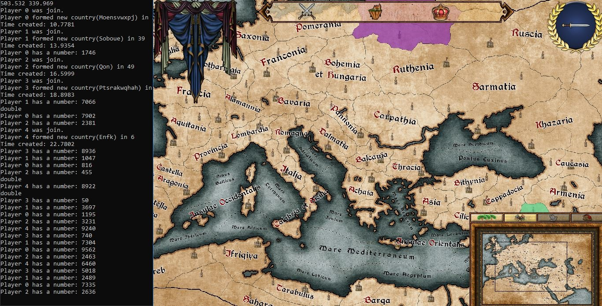
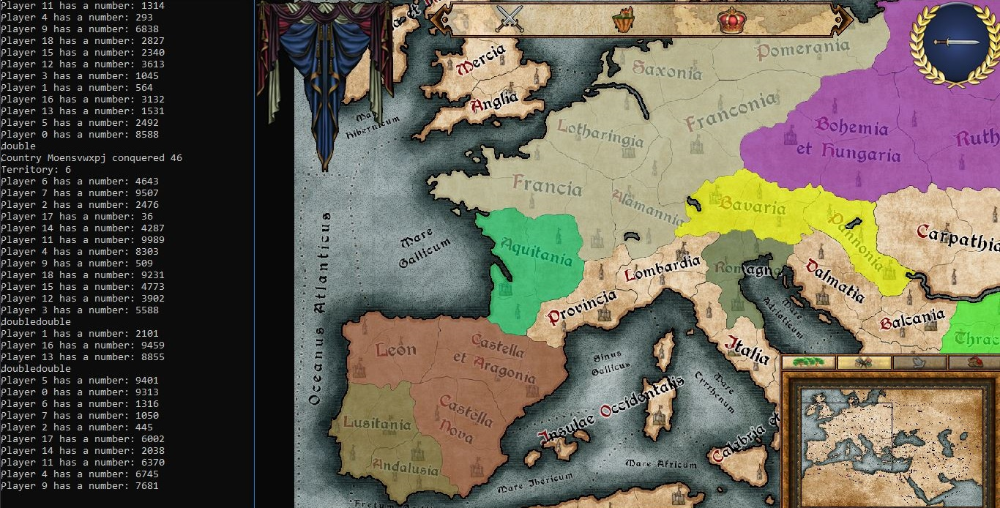
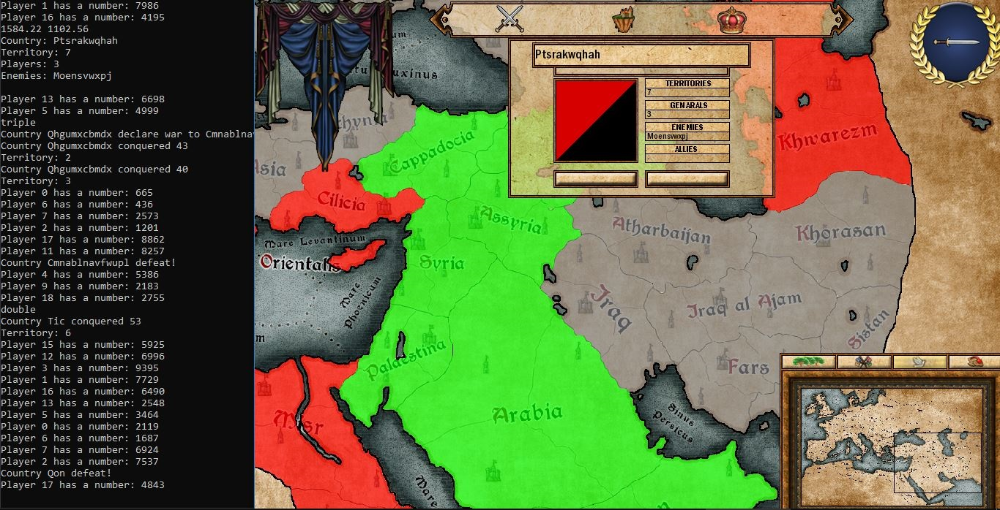
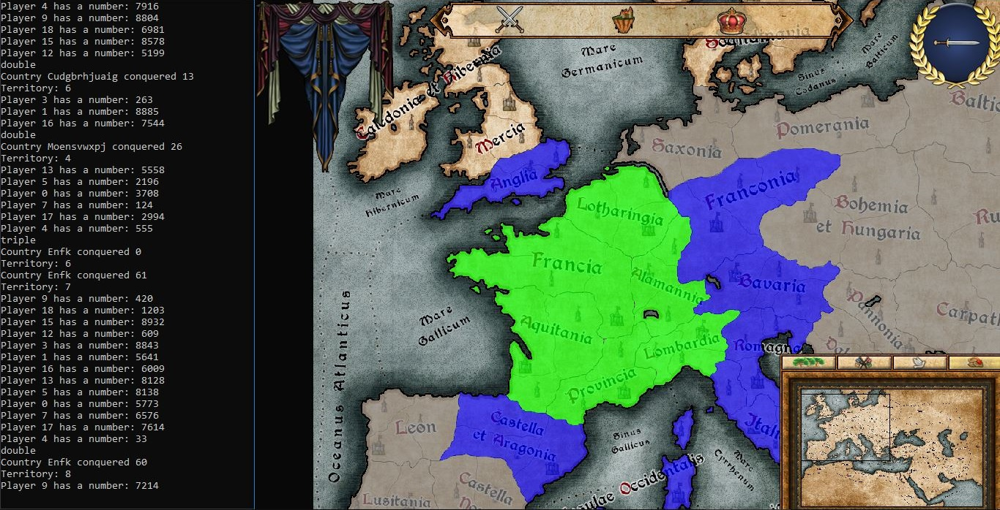

# Conquest something

Conquest something is roulette game on patchwork map. In a certain time interval each player can roll the special dice with 4 digits if he wants to gets power point. In case when player gets winner combination this mean he have power point now. Power can be spent for expand country terretories. Several players can play  for one country. 

In this game can play only bots because this is early version.

## Screenshots

  

  

  

  

## Game rules

Each player can roll dice every 5 second (you can see it in `BotEvent.h` function `bool executeRoll(float currentTime)`).  After roll player gets 4-digits  number like **2323**. When in number are 2 or more equals digits than player gets power point. In case when 2 digits on right side is equals (like this **3499**) player  gets 1 power. If 3 digits equals (**3999**) player gets 2 power. Else if all 4 digits equals ( **9999**) this mean player gets 3 power. But if he gets 2 pairs equals digits (**3399**)  in this case player obtain 2 power. All information about this in `Player.cpp` file.

All players can accumulate power and spend their power in any moment. A few players have ability to join one country and expand together. First country which conquered all map is winner (see more in `RelationshipManager.cpp` function `void CRelationshipManager::updateAI()`).

## How I can run it

Simplest way to run this application is download [Release](https://github.com/apsect/Conquest-something/tree/master/Release) folder and run [Conquest something.exe](https://github.com/apsect/Conquest-something/blob/master/Release/Conquest%20something.exe). But if you want compiled files you must to read [SFML official instruction](https://www.sfml-dev.org/tutorials/2.4/start-vc.php) first.

## Libraries used on the project

* [SFML](https://github.com/SFML/SFML)